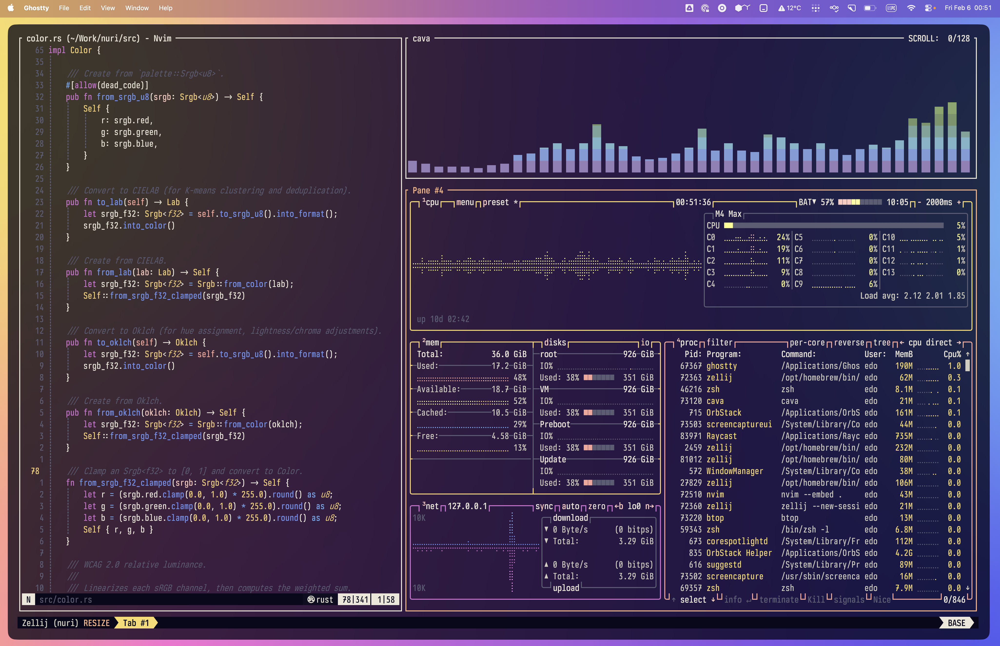

# nuri

> 塗り (*nuri*) — Japanese for "to paint" or "to coat"

Generate color themes from wallpaper images. Supports [Ghostty](https://ghostty.org/), [Zellij](https://zellij.dev/), and [Neovim](https://neovim.io/) backends.



nuri extracts dominant colors from an image using K-means clustering, maps them to ANSI palette slots via perceptual hue matching, enforces WCAG contrast minimums, and outputs a ready-to-use theme file.

## How it works

```
Image → resize 256x256 → K-means (LAB, K=16) → deduplicate → detect dark/light
      → hue-based ANSI slot assignment (Oklch) → bright variants → derive special colors
      → WCAG contrast enforcement → theme file
```

- **K-means in LAB space** for perceptually diverse palette extraction
- **Oklch color space** for all lightness, chroma, and hue adjustments
- **WCAG 2.0 contrast enforcement**: 4.5:1 for accents, 7:1 for foreground, 3:1 for bright-black
- **Auto dark/light detection** based on image luminance (overridable)

## Installation

```bash
cargo install --path .
```

## Usage

### CLI mode

```bash
# Generate Ghostty theme and print to stdout (default)
nuri ~/wallpapers/sunset.jpg

# Target a specific backend
nuri ~/wallpapers/sunset.jpg --target zellij
nuri ~/wallpapers/sunset.jpg --target neovim

# Install to each backend's standard config directory
nuri ~/wallpapers/sunset.jpg --target ghostty,zellij --install

# Write to a specific file
nuri ~/wallpapers/sunset.jpg -o ~/mytheme.conf

# Preview the palette in your terminal
nuri ~/wallpapers/sunset.jpg --preview

# Force light mode
nuri ~/wallpapers/sunset.jpg --mode light
```

### TUI mode

```bash
nuri ~/wallpapers/sunset.jpg --tui
```

Interactive terminal UI for previewing and tweaking the generated palette before saving. Keybindings:

| Key | Action |
|-----|--------|
| `d` / `l` | Toggle dark/light mode |
| `r` | Regenerate palette (new K-means seed) |
| `Tab` / `Shift+Tab` | Cycle through palette slots |
| `1`-`6` | Select accent slot |
| `+` / `-` | Adjust lightness (selected slot) |
| `s` / `S` | Adjust chroma (selected slot) |
| `Left` / `Right` | Cycle extracted colors (selected slot) |
| `Enter` | Save theme |
| `q` | Quit |
| `?` | Help |

### All options

```
nuri [OPTIONS] <IMAGE>

Arguments:
  <IMAGE>                            Path to the input image

Options:
  -n, --name <NAME>                  Theme name (defaults to image filename)
  -m, --mode <MODE>                  Force dark or light [values: dark, light]
  -t, --target <TARGET>              Backend(s), comma-separated [values: ghostty, zellij, neovim]
  -o, --output <OUTPUT>              Write theme to file instead of stdout
      --install                      Install to each backend's standard config directory
      --no-clobber                   Error instead of overwriting existing themes
      --preview                      Print colored palette preview
      --tui                          Launch interactive TUI
  -k, --colors <N>                   K-means clusters [default: 16]
      --min-contrast <RATIO>         Minimum accent contrast ratio [default: 4.5]
```

## Development

```bash
cargo build                  # Build
cargo test                   # Run tests
cargo clippy                 # Lint
cargo fmt --check            # Check formatting
./check.sh                   # Run all checks (fmt, clippy, test, build)
```

## Tech stack

| Crate | Purpose |
|-------|---------|
| [clap](https://crates.io/crates/clap) | CLI argument parsing |
| [image](https://crates.io/crates/image) | Image loading and resizing |
| [kmeans-colors](https://crates.io/crates/kmeans-colors) | K-means clustering for color extraction |
| [palette](https://crates.io/crates/palette) | Color space conversions (sRGB, LAB, Oklch) |
| [ratatui](https://crates.io/crates/ratatui) | Terminal UI framework |
| [crossterm](https://crates.io/crates/crossterm) | Terminal backend for ratatui |
| [anyhow](https://crates.io/crates/anyhow) | Error handling |

## License

MIT
