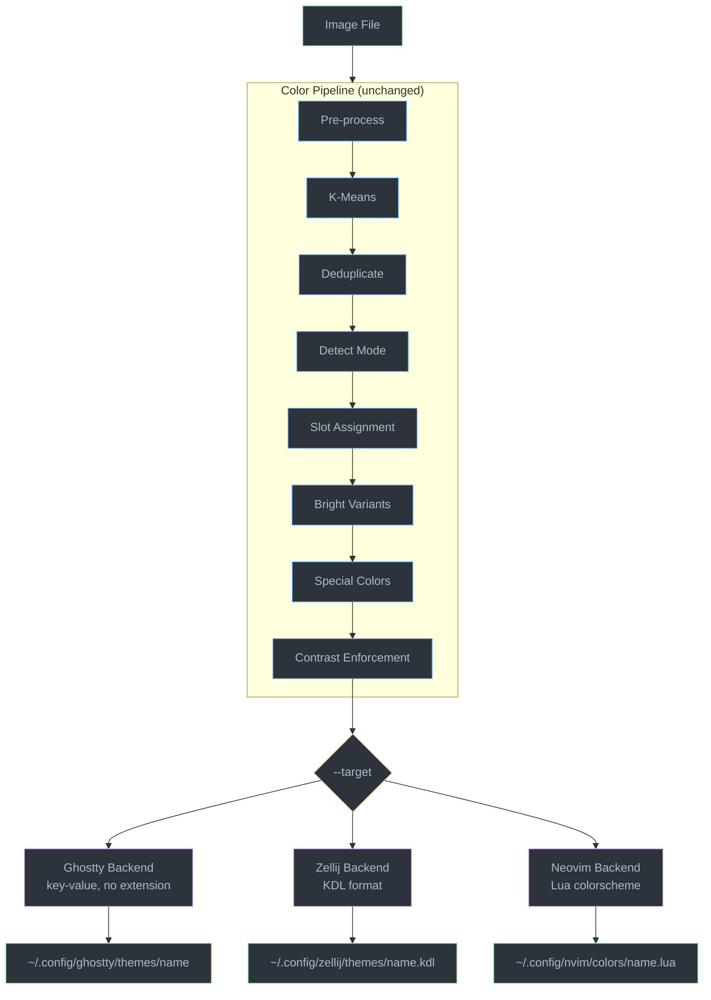

# nuri — Product Requirements Document (Phase 2)

## Name

**nuri** (塗り) — Japanese for "to paint" or "to coat". From the verb 塗る (*nuru*), meaning to apply color onto a surface. The name reflects what the tool does: it coats your terminal, multiplexer, and editor with colors extracted from your wallpaper.

## Overview

**Phase 2** evolves ghostty-themer from a Ghostty-only tool into **nuri**, a multi-target theme generator. The color extraction pipeline (image → K-means → palette → contrast enforcement) remains unchanged. The project gains a **backend system** that serializes the same `AnsiPalette` into different formats, starting with **Zellij** (KDL) and **Neovim** (Lua colorscheme) alongside the existing Ghostty output.

### What changes

- Project rename: `ghostty-themer` → `nuri`
- New `--target` CLI flag to select output backends (default: `ghostty`)
- Trait-based backend architecture (`ThemeBackend`) replacing the hard-coded `GhosttyTheme`
- Zellij backend: generates a KDL theme file
- Neovim backend: generates a Lua colorscheme (single-file `colors/*.lua`)
- TUI supports choosing which backend to save with

### What does NOT change

- The entire color pipeline (`pipeline/*`, `color.rs`)
- The `AnsiPalette` struct and its semantics
- Image loading, K-means extraction, contrast enforcement
- Existing CLI flags (`--mode`, `--preview`, `-k`, `--min-contrast`, etc.)
- The TUI palette editing experience

---

## Goals

- Generate consistent, wallpaper-driven themes across Ghostty, Zellij, and Neovim from a single palette
- Maintain the existing Ghostty workflow — zero breaking changes for current users
- Make adding future backends (Kitty, Alacritty, WezTerm, etc.) trivial (~100-200 lines each)
- Keep the pipeline as the single source of truth — all backends consume the same `AnsiPalette`

## Non-Goals

- Adding new terminals beyond Ghostty, Zellij, and Neovim in this phase
- Changing the color extraction pipeline or `AnsiPalette` struct
- Plugin ecosystem or user-defined backends
- Neovim plugin integration (LSP, lazy.nvim auto-setup, etc.) — we generate a colorscheme file, nothing more

---

## Architecture

### Backend Trait

```rust
pub trait ThemeBackend {
    /// Human-readable name shown in CLI help and TUI (e.g., "Ghostty", "Zellij").
    fn name(&self) -> &str;

    /// Serialize the palette into the target format.
    fn serialize(&self, palette: &AnsiPalette, theme_name: &str) -> String;

    /// Install the theme to the target's standard config directory.
    /// Returns the path where the theme was written.
    fn install(&self, palette: &AnsiPalette, theme_name: &str) -> Result<PathBuf>;

    /// Write the theme to an arbitrary path.
    fn write_to(&self, palette: &AnsiPalette, theme_name: &str, path: &Path) -> Result<()>;
}
```

Each backend is a zero-size struct implementing `ThemeBackend`. The `theme_name` parameter is passed to `serialize` because some formats embed the name (Zellij KDL, Neovim `vim.g.colors_name`).

### Module Layout

```
src/
  pipeline/              # UNCHANGED
  color.rs               # UNCHANGED
  preview.rs             # UNCHANGED
  cli.rs                 # Add --target flag + Target enum
  main.rs                # Dispatch to selected backend(s)
  tui/
    mod.rs               # Add backend selection to save flow
    widgets.rs           # UNCHANGED
  backends/
    mod.rs               # ThemeBackend trait + backend registry
    ghostty.rs           # Extracted from current theme.rs
    zellij.rs            # NEW
    neovim.rs            # NEW
```

`src/theme.rs` is replaced by `src/backends/ghostty.rs` — the code moves, the logic stays identical.

### System Diagram (Phase 2 additions in bold)



---

## CLI Changes

### New `--target` flag

```
nuri <IMAGE> [OPTIONS]
```

**New option:**
- `-t, --target <TARGET>` — Output target(s). Comma-separated. Values: `ghostty`, `zellij`, `neovim`. Default: `ghostty`.

**Examples:**
```bash
# Ghostty only (backwards-compatible default)
nuri ~/wallpapers/sunset.jpg --install

# Zellij theme
nuri ~/wallpapers/sunset.jpg --target zellij --install

# Neovim colorscheme
nuri ~/wallpapers/sunset.jpg --target neovim --install

# Multiple targets at once
nuri ~/wallpapers/sunset.jpg --target ghostty,zellij,neovim --install

# Output to stdout (single target only)
nuri ~/wallpapers/sunset.jpg --target zellij

# Force output path (single target only)
nuri ~/wallpapers/sunset.jpg --target neovim -o ~/my-theme.lua
```

**Constraints:**
- `-o` / `--output` requires exactly one target (ambiguous otherwise)
- `--install` works with any number of targets — each backend installs to its own standard directory
- Stdout output (no flags) requires exactly one target

### Binary name

The binary name changes from `ghostty-themer` to `nuri`. The `Cargo.toml` `[[bin]]` section reflects this. The crate name becomes `nuri`.

---

## Backend: Ghostty

No behavioral changes. The current `src/theme.rs` logic moves to `src/backends/ghostty.rs`.

**Install path:** `$XDG_CONFIG_HOME/ghostty/themes/<name>` (no file extension)

**Format:** (unchanged)
```
background = #1a1b26
foreground = #c0caf5
cursor-color = #c0caf5
cursor-text = #1a1b26
selection-background = #33467c
selection-foreground = #c0caf5
palette = 0=#15161e
palette = 1=#f7768e
...
palette = 15=#c0caf5
```

---

## Backend: Zellij

### Format

Zellij themes use **KDL** (KDL Document Language). A theme file contains a `themes` block wrapping a named theme node with **named color keys** (not indexed slots).

**Install path:** `$XDG_CONFIG_HOME/zellij/themes/<name>.kdl`

### Color Mapping

Zellij uses 11 named color keys. The mapping from `AnsiPalette` is:

| Zellij key | AnsiPalette source | Notes |
|------------|-------------------|-------|
| `fg`       | `palette.foreground` | |
| `bg`       | `palette.background` | |
| `black`    | `slots[0]` | ANSI black |
| `red`      | `slots[1]` | ANSI red |
| `green`    | `slots[2]` | ANSI green |
| `yellow`   | `slots[3]` | ANSI yellow |
| `blue`     | `slots[4]` | ANSI blue |
| `magenta`  | `slots[5]` | ANSI magenta |
| `cyan`     | `slots[6]` | ANSI cyan |
| `white`    | `slots[7]` | ANSI white |
| `orange`   | derived | Zellij-specific; see below |

**Orange derivation:** Zellij expects an `orange` color that has no ANSI equivalent. Derive it by interpolating in Oklch between slot 1 (red, hue ~25) and slot 3 (yellow, hue ~90) — target hue ~55, using the average lightness and chroma of the two source slots.

### Output Format

```kdl
themes {
    mytheme {
        fg "#c0caf5"
        bg "#1a1b26"
        black "#15161e"
        red "#f7768e"
        green "#9ece6a"
        yellow "#e0af68"
        blue "#7aa2f7"
        magenta "#bb9af7"
        cyan "#7dcfff"
        white "#a9b1d6"
        orange "#ff9e64"
    }
}
```

We use hex strings (quoted `"#rrggbb"`) rather than RGB triplets for consistency with the pipeline's hex output and readability.

### Serialization Rules

- Theme name is embedded in the KDL structure
- Hex values are lowercase
- One color per line, indented with 8 spaces (4 for theme block, 4 for color)
- Trailing newline after closing braces

---

## Backend: Neovim

### Format

Neovim colorschemes are **Lua files** using the `vim.api.nvim_set_hl()` API. We generate a single self-contained file that goes in `colors/`.

**Install path:** `$XDG_CONFIG_HOME/nvim/colors/<name>.lua`

### Palette-to-Highlight Mapping

The Neovim backend maps `AnsiPalette` colors to semantic highlight groups. This is the core design decision — how ANSI colors translate to editor semantics.

#### Palette Variables

The generated Lua file first defines a `colors` table derived from `AnsiPalette`:

| Lua variable | AnsiPalette source | Semantic role |
|-------------|-------------------|---------------|
| `bg` | `palette.background` | Editor background |
| `fg` | `palette.foreground` | Default text |
| `black` | `slots[0]` | Darkest base |
| `red` | `slots[1]` | Errors, deletions |
| `green` | `slots[2]` | Strings, additions |
| `yellow` | `slots[3]` | Warnings, types, constants |
| `blue` | `slots[4]` | Functions, links |
| `magenta` | `slots[5]` | Keywords, statements |
| `cyan` | `slots[6]` | Operators, special |
| `white` | `slots[7]` | Light base text |
| `bright_black` | `slots[8]` | Comments, line numbers |
| `bright_red` | `slots[9]` | Bright error accent |
| `bright_green` | `slots[10]` | Bright string accent |
| `bright_yellow` | `slots[11]` | Bright warning accent |
| `bright_blue` | `slots[12]` | Bright function accent |
| `bright_magenta` | `slots[13]` | Bright keyword accent |
| `bright_cyan` | `slots[14]` | Bright special accent |
| `bright_white` | `slots[15]` | Brightest text |
| `selection` | `palette.selection_bg` | Visual selection |
| `cursor` | `palette.cursor_color` | Cursor |
| `surface` | derived | UI surfaces (slightly offset from bg) |

**Surface derivation:** `surface` is the background shifted slightly toward the foreground in Oklch — L += 0.03 for dark mode, L -= 0.03 for light mode. Used for `CursorLine`, `StatusLine`, `NormalFloat`, etc.

#### Highlight Group Assignments

##### Editor UI Groups

| Group | fg | bg | Style |
|-------|----|----|-------|
| `Normal` | `fg` | `bg` | — |
| `NormalFloat` | `fg` | `surface` | — |
| `FloatBorder` | `bright_black` | `surface` | — |
| `Visual` | — | `selection` | — |
| `Cursor` | `bg` | `cursor` | — |
| `CursorLine` | — | `surface` | — |
| `CursorLineNr` | `yellow` | `surface` | — |
| `LineNr` | `bright_black` | — | — |
| `SignColumn` | — | `bg` | — |
| `StatusLine` | `fg` | `surface` | — |
| `StatusLineNC` | `bright_black` | `black` | — |
| `TabLine` | `bright_black` | `black` | — |
| `TabLineSel` | `fg` | `surface` | bold |
| `TabLineFill` | — | `black` | — |
| `WinSeparator` | `bright_black` | — | — |
| `Pmenu` | `fg` | `surface` | — |
| `PmenuSel` | `bg` | `blue` | — |
| `PmenuSbar` | — | `surface` | — |
| `PmenuThumb` | — | `bright_black` | — |
| `Search` | `bg` | `yellow` | — |
| `IncSearch` | `bg` | `bright_yellow` | — |
| `MatchParen` | `bright_cyan` | — | bold |
| `ErrorMsg` | `red` | — | — |
| `WarningMsg` | `yellow` | — | — |
| `Title` | `blue` | — | bold |
| `SpecialKey` | `bright_black` | — | — |
| `NonText` | `bright_black` | — | — |
| `Directory` | `blue` | — | — |
| `Question` | `green` | — | — |
| `MoreMsg` | `green` | — | — |
| `ModeMsg` | `fg` | — | bold |
| `WildMenu` | `bg` | `blue` | — |

##### Diagnostic Groups

| Group | fg | Style |
|-------|-----|-------|
| `DiagnosticError` | `red` | — |
| `DiagnosticWarn` | `yellow` | — |
| `DiagnosticInfo` | `blue` | — |
| `DiagnosticHint` | `cyan` | — |
| `DiagnosticUnderlineError` | — | undercurl, sp=`red` |
| `DiagnosticUnderlineWarn` | — | undercurl, sp=`yellow` |
| `DiagnosticUnderlineInfo` | — | undercurl, sp=`blue` |
| `DiagnosticUnderlineHint` | — | undercurl, sp=`cyan` |

##### Syntax Groups (Vim standard)

| Group | fg | Style |
|-------|-----|-------|
| `Comment` | `bright_black` | italic |
| `Constant` | `yellow` | — |
| `String` | `green` | — |
| `Character` | `green` | — |
| `Number` | `yellow` | — |
| `Boolean` | `yellow` | — |
| `Float` | `yellow` | — |
| `Identifier` | `fg` | — |
| `Function` | `blue` | — |
| `Statement` | `magenta` | — |
| `Conditional` | `magenta` | — |
| `Repeat` | `magenta` | — |
| `Label` | `magenta` | — |
| `Operator` | `cyan` | — |
| `Keyword` | `magenta` | — |
| `Exception` | `magenta` | — |
| `PreProc` | `cyan` | — |
| `Include` | `cyan` | — |
| `Define` | `magenta` | — |
| `Macro` | `magenta` | — |
| `Type` | `yellow` | — |
| `StorageClass` | `yellow` | — |
| `Structure` | `yellow` | — |
| `Typedef` | `yellow` | — |
| `Special` | `cyan` | — |
| `SpecialChar` | `cyan` | — |
| `Delimiter` | `fg` | — |
| `SpecialComment` | `bright_black` | bold |
| `Debug` | `red` | — |
| `Underlined` | `blue` | underline |
| `Error` | `red` | — |
| `Todo` | `yellow` | bold, italic |

##### TreeSitter Groups

TreeSitter groups link to standard Vim groups by default. We override a subset for better semantics:

| Group | Maps to | Notes |
|-------|---------|-------|
| `@variable` | `fg` | Default text color for variables |
| `@variable.builtin` | `red` | `self`, `this` |
| `@variable.parameter` | `bright_red` | Function parameters |
| `@variable.member` | `fg` | Struct/object fields |
| `@constant` | link → `Constant` | |
| `@constant.builtin` | `yellow`, bold | `true`, `false`, `nil` |
| `@string` | link → `String` | |
| `@string.escape` | `bright_cyan` | `\n`, `\t` |
| `@string.regex` | `bright_green` | Regular expressions |
| `@number` | link → `Number` | |
| `@boolean` | link → `Boolean` | |
| `@function` | link → `Function` | |
| `@function.builtin` | `blue`, bold | Built-in functions |
| `@function.call` | `blue` | |
| `@function.macro` | `magenta` | Rust macros, C macros |
| `@method` | `blue` | |
| `@method.call` | `blue` | |
| `@constructor` | `yellow` | |
| `@keyword` | link → `Keyword` | |
| `@keyword.function` | `magenta` | `fn`, `def`, `func` |
| `@keyword.return` | `magenta`, bold | `return` |
| `@keyword.operator` | `cyan` | `and`, `or`, `not` |
| `@keyword.conditional` | link → `Conditional` | |
| `@keyword.repeat` | link → `Repeat` | |
| `@keyword.import` | `cyan` | `use`, `import` |
| `@keyword.exception` | link → `Exception` | |
| `@operator` | link → `Operator` | |
| `@type` | link → `Type` | |
| `@type.builtin` | `yellow`, italic | `int`, `str`, `bool` |
| `@type.definition` | `yellow` | Type definitions |
| `@module` | `cyan` | Modules / namespaces |
| `@property` | `fg` | Properties |
| `@attribute` | `cyan` | Decorators, attributes |
| `@punctuation.delimiter` | `fg` | `,`, `;` |
| `@punctuation.bracket` | `fg` | `()`, `[]`, `{}` |
| `@punctuation.special` | `cyan` | Template literals |
| `@comment` | link → `Comment` | |
| `@comment.todo` | link → `Todo` | |
| `@comment.error` | `red`, bold | `ERROR`, `FIXME` |
| `@comment.warning` | `yellow`, bold | `WARNING`, `WARN` |
| `@comment.note` | `blue`, bold | `NOTE`, `INFO` |
| `@markup.heading` | `blue`, bold | Markdown headings |
| `@markup.strong` | — | bold |
| `@markup.italic` | — | italic |
| `@markup.link` | `blue`, underline | URLs and links |
| `@markup.raw` | `green` | Code blocks |
| `@tag` | `red` | HTML/JSX tags |
| `@tag.attribute` | `yellow` | HTML attributes |
| `@tag.delimiter` | `fg` | `<`, `>`, `/>` |

### Generated Output Format

The Neovim backend produces a single Lua file:

```lua
-- nuri: <name>
-- Generated from <image-filename> by nuri
-- https://github.com/<user>/nuri

vim.cmd("highlight clear")
if vim.fn.exists("syntax_on") then
  vim.cmd("syntax reset")
end
vim.g.colors_name = "<name>"

local c = {
  bg            = "#1a1b26",
  fg            = "#c0caf5",
  black         = "#15161e",
  red           = "#f7768e",
  green         = "#9ece6a",
  yellow        = "#e0af68",
  blue          = "#7aa2f7",
  magenta       = "#bb9af7",
  cyan          = "#7dcfff",
  white         = "#a9b1d6",
  bright_black  = "#414868",
  bright_red    = "#f7768e",
  bright_green  = "#9ece6a",
  bright_yellow = "#e0af68",
  bright_blue   = "#7aa2f7",
  bright_magenta = "#bb9af7",
  bright_cyan   = "#7dcfff",
  bright_white  = "#c0caf5",
  selection     = "#33467c",
  cursor        = "#c0caf5",
  surface       = "#1f2030",
}

local hl = vim.api.nvim_set_hl

-- Editor UI
hl(0, "Normal", { fg = c.fg, bg = c.bg })
hl(0, "NormalFloat", { fg = c.fg, bg = c.surface })
hl(0, "Visual", { bg = c.selection })
hl(0, "CursorLine", { bg = c.surface })
-- ... (all groups from the tables above)

-- Syntax
hl(0, "Comment", { fg = c.bright_black, italic = true })
hl(0, "String", { fg = c.green })
hl(0, "Function", { fg = c.blue })
hl(0, "Keyword", { fg = c.magenta })
-- ... (all groups)

-- TreeSitter
hl(0, "@variable", { fg = c.fg })
hl(0, "@function", { link = "Function" })
-- ... (all groups)

-- Diagnostics
hl(0, "DiagnosticError", { fg = c.red })
-- ... (all groups)
```

### Serialization Rules

- Valid Lua syntax — the file must parse without errors
- `vim.g.colors_name` must match the theme name (sanitized: lowercase, hyphens/underscores only)
- All color values are hex strings, lowercase
- Groups are organized in sections with comments for readability
- `link` groups use `{ link = "GroupName" }` — no fg/bg
- Local alias `hl = vim.api.nvim_set_hl` for conciseness

---

## TUI Changes

### Backend Selection

The TUI save flow (`Enter`) gains a backend selector:

1. User presses `Enter`
2. If `--target` was specified on launch, use that backend. Otherwise show a selection popup: `[G]hostty  [Z]ellij  [N]eovim`
3. User picks a backend (or all)
4. Name input prompt appears (pre-filled with current theme name)
5. Theme is installed to the selected backend's standard directory
6. Status bar shows: `Installed '<name>' for Ghostty` (or whichever backend)

**Multiple targets:** The popup allows selecting multiple backends. Pressing `a` selects all.

### No other TUI changes

The palette editing, preview pane, color tweaking, and regeneration all work with `AnsiPalette` and are backend-agnostic. Only the save path changes.

---

## Error Handling

- **Zellij config dir missing:** Create `~/.config/zellij/themes/` recursively (same as Ghostty behavior)
- **Neovim config dir missing:** Create `~/.config/nvim/colors/` recursively
- **Invalid theme name for Neovim:** Sanitize to `[a-z0-9_-]+` — replace invalid characters with `_`, warn if modified
- **Multiple targets with `-o`:** Error: "cannot use --output with multiple targets; use --install instead"
- **Multiple targets with stdout:** Error: "cannot output multiple targets to stdout; use --install or specify a single --target"

---

## Testing Strategy

### Backend-specific tests

**Ghostty backend:**
- Existing tests move to `src/backends/ghostty.rs` — no behavioral changes

**Zellij backend:**
- Serialization produces valid KDL structure
- All 11 color keys present (`fg`, `bg`, `black`, `red`, `green`, `yellow`, `blue`, `magenta`, `cyan`, `white`, `orange`)
- Theme name is embedded correctly
- Hex values are lowercase, quoted
- Orange is derived (not black/empty)
- Snapshot test against known palette

**Neovim backend:**
- Generated Lua is syntactically valid (test by parsing with `luac -p` or a Lua parser)
- `vim.g.colors_name` is set correctly
- All essential highlight groups are present (at minimum: `Normal`, `Comment`, `String`, `Function`, `Keyword`, `Type`, `Error`, `Visual`, `CursorLine`, `StatusLine`, `LineNr`, `Pmenu`, `PmenuSel`, `Search`, `DiagnosticError`)
- No group references an undefined color variable
- Snapshot test against known palette

### Trait-level tests

- Every registered backend implements `ThemeBackend`
- `serialize()` produces non-empty output for any valid palette
- `install()` creates the file at the expected path
- Round-trip: serialize → write → read back → content matches

### CLI integration tests

- `--target ghostty` produces Ghostty format (default behavior)
- `--target zellij` produces KDL format
- `--target neovim` produces Lua format
- `--target ghostty,zellij` with `--install` installs both
- `--target ghostty,zellij` without `--install` or `-o` → error
- `-o` with multiple targets → error

---

## Rename Checklist

The rename from `ghostty-themer` to `nuri` must be applied consistently across the entire project:

### Code & config
- `Cargo.toml`: crate name → `nuri`, binary name → `nuri`, package description updated
- `src/cli.rs`: `#[command(name = "nuri", ...)]`, help text updated
- `src/lib.rs` / `src/main.rs`: `use nuri::` imports (crate rename)
- All integration tests: `use nuri::` imports, binary name in CLI tests
- Snapshot files: regenerate if they embed the binary name

### Documentation
- `CLAUDE.md`: update project overview, build/run examples, project structure, commit references
- `product-definition/PRD-1.md`: add a note at the top that the project has been renamed to nuri; keep the original content as historical reference
- `README.md` (if exists): full rewrite with new name, examples, description

### Repository
- GitHub repository rename (if applicable): `ghostty-themer` → `nuri`
- Git remote URLs updated accordingly

---

## Future Considerations (out of scope for Phase 2)

- **Terminal backends:** Kitty (`.conf`), Alacritty (TOML), WezTerm (TOML/Lua), iTerm2 (`.itermcolors` XML plist)
- **Neovim plugin structure:** Multi-file plugin with `lua/` directory, lazy.nvim integration, light/dark variant toggle
- **Neovim extended groups:** LSP semantic tokens (`@lsp.type.*`), plugin-specific groups (Telescope, NvimTree, mini.nvim, etc.)
- **Zellij extended theming:** If Zellij adds more theme keys in the future (emphasis levels, pane border colors)
- **Template overrides:** User-supplied templates for fine-tuning highlight mappings
- **Export to shareable formats:** Generate a theme repository with all backends, README, screenshots
